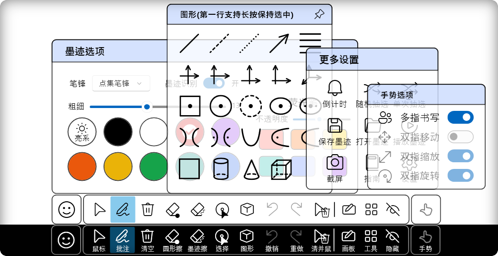
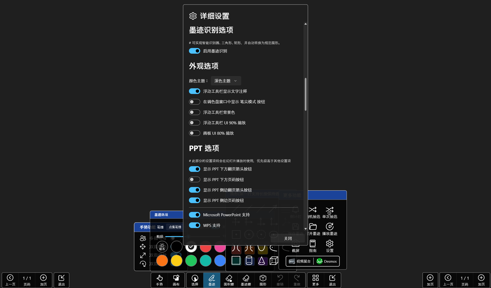
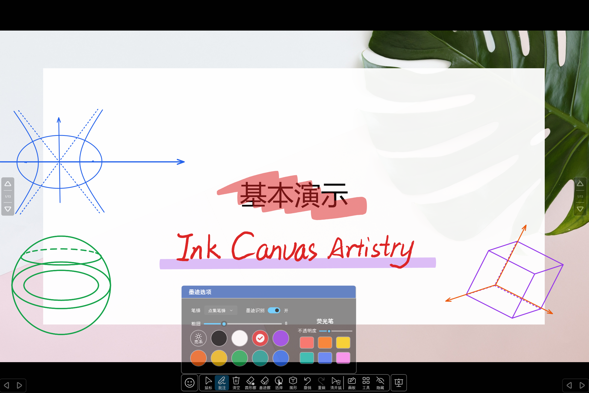

# Ink Canvas Ultra

## 👋 欢迎使用 Ink Canvas Ultra

Ink Canvas Ultra 是一款轻量级、高性能的电子白板软件，专为教学和演示场景优化，基于 GPLv3 许可证发布。

## 🌟 项目简介

Ink Canvas Ultra 画板是一款针对希沃白板设备进行了特别优化的轻量级画板软件，与预装的"希沃白板 5"软件相比，启动速度大幅度提升（提升5-10倍），系统资源占用更小，使用体验更佳。

## 📁 目录结构

本项目（c:\Users\muqiu\Desktop\board\ica）包含以下主要内容：

- **Ink Canvas/**: 主程序源代码目录
  - **Helpers/**: 辅助功能类库
  - **MainWindow_cs/**: 主窗口相关代码文件
  - **Resources/**: 图标、样式等资源文件
  - **Windows/**: 各种功能窗口
- **Images/**: 应用程序图标和截图
- **.github/**: GitHub相关配置文件和工作流
- **LICENSE**: GPLv3开源许可证
- **README.md**: 项目说明文档
- **Manual.md**: 详细使用手册

## 🚀 主要功能

### 三种工作模式
- **幻灯片模式**: 在PowerPoint放映时提供批注工具
- **画板模式**: 类似希沃白板的黑板/白板功能
- **屏幕画笔模式**: 在任意屏幕内容上进行标注

### 智能交互体验
- 支持压感笔，笔的细头书写，粗头可作橡皮擦
- 手掌/手背可作为区域橡皮擦
- 双指缩放、旋转、拖动墨迹
- 自动识别图形并转换为规范图形

### 丰富的绘图工具
- 各种预设图形：直线、虚线、圆、椭圆、双曲线、抛物线等
- 坐标系工具：平面直角坐标系、空间直角坐标系
- 几何图形：长方体、圆锥、圆柱
- 平行线绘制（适合电场线等教学场景）

### 实用辅助功能
- 倒计时计时器
- 抽奖功能（支持导入名单）
- 自动保存墨迹和截图
- 墨迹回放功能
- 多指手势操作

## 🛠️ 技术特点

- **高性能**: 启动速度快，资源占用小
- **兼容性**: 特别优化适配希沃白板设备
- **智能识别**: 支持墨迹自动识别转换为规范图形
- **统一体验**: 幻灯片和白板模式下操作习惯一致
- **扩展性**: 支持多页白板、缩放、旋转等高级功能

## 💡 使用提示

- 双击"清屏"按钮可同时隐藏画板
- 手掌/手背可作为大面积橡皮擦
- 空间不足时可双指滑动或缩放调整视图
- 支持在PowerPoint放映时自动保存批注

## ⚠️ 提示
- 对新功能的有效意见和合理建议，开发者会适时回复并进行开发。本软件并非商业性质软件，请勿催促开发者，耐心才能让功能更少 BUG、更加稳定。

> 等待是人类的一种智慧

## 📗 FAQ

### 点击放映后一翻页就闪退？
考虑是由于`Microsoft Office`未激活导致的，请自行激活

### 放映后画板程序不会切换到PPT模式？
如果你曾经安装过`WPS`且在卸载后发现此问题则是由于暂时未确定的问题所导致，可以尝试重新安装WPS
> “您好，关于您反馈的情况我们已经反馈技术同学进一步分析哈，辛苦您可以留意后续WPS版本更新哈~” --回复自WPS客服

另外，处在保护（只读）模式的PPT不会被识别

若因安装了最新版本的 WPS 而导致无法在 WPS 软件内进入 PPT 模式，可以尝试卸载 WPS 后，并清除电脑垃圾、注册表垃圾、删除电脑上所有带 "kingsoft" 名称的文件夹，重新安装 WPS 2021 后，（以上步骤可能有多余步骤），经测试在 WPS 内可以正常进入 PPT 模式。

### **安装后**程序无法正常启动？
请检查你的电脑上是否安装了 `.Net Framework 4.7.2` 或更高版本。若没有，请前往官网下载 [.Net 4.7.2](https://dotnet.microsoft.com/en-us/download/dotnet-framework/thank-you/net472-offline-installer)
。如果仍无法运行，请检查你的电脑上是否安装了 `Microsoft Office`。若没有，请安装后重试

### 我该在何处提出功能需求和错误报告？

1. GitHub Issues

    功能需求：https://github.com/muqiu-pika/Ink-Canvas-Ultra/labels/enhancement/new 

    错误报告：https://github.com/muqiu-pika/Ink-Canvas-Ultra/labels/bug/new